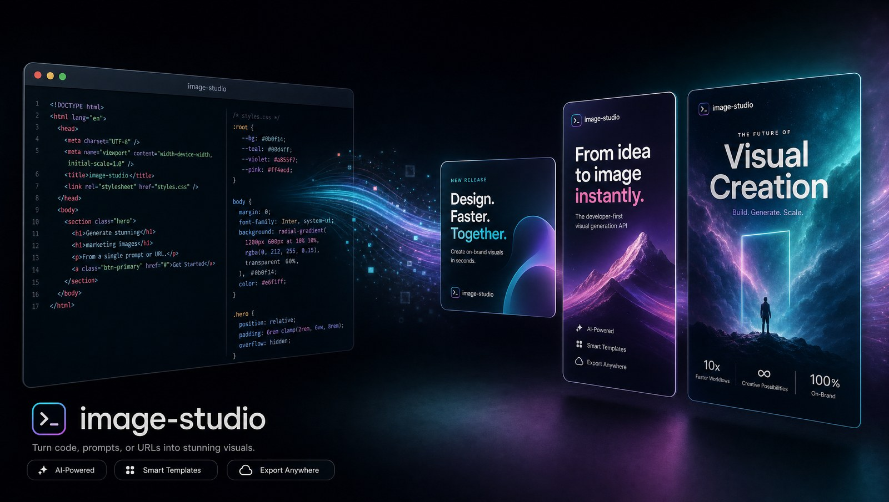

# image-studio



**Canva-quality static images for [Claude Code](https://claude.com/claude-code) — no Canva, no design tool, no AI image model.**

---

## Stop opening Canva to make one more ad.

You don't have a creative problem. You have a *throughput* problem.

The campaign needs a square ad, a portrait, a story, and an OG card. Each one means leaving your terminal, hunting for the right template, nudging text boxes by hand, exporting, re-uploading, and doing it again the moment a headline changes. The design isn't hard. The **forty-minute round trip for a graphic you'll revise twice tomorrow** is what's killing your week.

And the winners? They're trapped. That ad that's crushing it right now lives as a flattened PNG in someone's drive. You can't version it. You can't hand it to a teammate as a starting point. You can't spin twelve variants for split-testing without rebuilding it from scratch, by hand, in a tool that fights you.

**There's a better way to make statics — and it lives inside the tool you're already in.**

image-studio turns Claude Code into your design department. You describe the graphic in plain language; Claude writes modern HTML/CSS and renders it to a pixel-perfect PNG with headless Chromium. Full CSS, Tailwind, Google Fonts, gradients, blend modes, SVG, frosted glass — **everything a browser can paint, which is everything Canva can and more.** No subscription. No context-switch. No design tax.

Because every creative is *code*, you get things a drag-and-drop editor structurally cannot give you:

- **It's instant and in-flow.** Ask for the ad, get the PNG, iterate in the same breath you're shipping the campaign. No app, no tab, no export dance.
- **It version-controls.** Every creative is a text file. `git diff` your headline changes. Roll back a bad variant. Review designs in a PR like you review code.
- **It templatizes your winners.** Share a screenshot or URL of an ad that's working — Claude samples the exact colors from the pixels, measures the layout, extracts the photo region, and hands you back a **parametric template with swappable variables** (photo, headline, price, city, brand colors). The winner stops being a dead PNG and becomes an asset you re-render forever.
- **It scales sideways.** One template → fifty on-brand variants from a loop. Carousels, localized city ads, A/B headline sets — generated, not hand-built.
- **It doesn't look generic.** Ships with distinct aesthetic systems — editorial, brutalist, direct-response, photo-luxury, Swiss — so your output doesn't wear the same house style as everyone else's.

> *"We can now share winning images and get templates out of them."*

That's the unlock. `templates/ad-roofing-financing.html` in this repo is a real example — reverse-engineered from a live roofing ad (yellow band, navy tab, big payment number). Swap five variables, render, ship the next one in seconds.

It's MIT-licensed and free. Cloning it costs you one command and about 300MB of Chromium. The next ad you would have built by hand in Canva is the last one you'll need to.

**Install it, then just ask Claude for the graphic. ⬇️**

---

## Install

### As a Claude Code skill (recommended)

Clone into your project's (or user-level) skills directory:

```bash
git clone https://github.com/ai-agents-for-agencies-coaches/image-studio.git \
  ~/.claude/skills/image-studio

cd ~/.claude/skills/image-studio
npm install          # installs Playwright + Chromium
```

Claude will auto-discover the skill via `SKILL.md`. Just ask: *"make me a 1080x1080 Facebook ad for…"* or *"build a template from this ad: <url>"*.

### Standalone CLI

```bash
git clone https://github.com/ai-agents-for-agencies-coaches/image-studio.git
cd image-studio
npm install
```

---

## Usage

```bash
node render.js \
  --input templates/aesthetic-editorial.html \
  --output out.png \
  --width 1080 --height 1080 --scale 2
```

| Flag | Default | Purpose |
|------|---------|---------|
| `--input` | required | Path to the HTML file |
| `--output` | required | Output PNG/JPEG path |
| `--width` | 1080 | Viewport width (CSS px) |
| `--height` | 1080 | Viewport height (CSS px) |
| `--scale` | 2 | Device pixel ratio (2 = retina) |
| `--full-page` | false | Capture full scroll height |
| `--selector` | none | Capture only the element matching this CSS selector |
| `--format` | png | `png` or `jpeg` |
| `--quality` | 100 | JPEG quality (1–100) |

### Common dimensions

| Format | W × H | Scale |
|--------|-------|-------|
| FB/IG square ad | 1080×1080 | 2 |
| FB/IG portrait ad | 1080×1350 | 2 |
| FB/IG story / reel | 1080×1920 | 2 |
| OG / Twitter card | 1200×630 | 2 |
| LinkedIn post | 1200×1200 | 2 |
| YouTube thumbnail | 1280×720 | 2 |

---

## Templates

Starter HTML in `templates/` — scaffolds, not constraints. Edit freely.

**Format starters**
- `ad-square-1080.html` — bold headline + CTA
- `ad-portrait-1080x1350.html` — image-led ad with overlay copy
- `story-1080x1920.html` — vertical full-bleed story
- `og-1200x630.html` — clean OG / share card
- `poster-hero.html` — magazine-style hero

**Distinct aesthetic families** (so output never looks like one house style)
- `aesthetic-editorial.html` — cream + ink + rust, Fraunces serif
- `aesthetic-brutalist.html` — white/black/red, heavy borders, mono type
- `aesthetic-direct-response.html` — yellow/black retail flyer, sunburst
- `aesthetic-photo-luxury.html` — full-bleed photo, whisper serif
- `aesthetic-swiss.html` — grid, single accent, Inter

**Reverse-engineered example**
- `ad-roofing-financing.html` — real ad turned into a 5-variable template (ships with a bundled sample photo in `assets/`)

See `examples/` for rendered references — study these for the quality bar before designing.

---

## How it works

`render.js` launches headless Chromium via Playwright, loads your HTML from a `file://` URL, waits for `document.fonts.ready` (so web fonts never render blank), and screenshots at the requested resolution and DPI. That's it — the browser is the design engine.

## Requirements

- Node.js 18+
- ~300MB for the Chromium download (`npm install` handles it)

## License

MIT — see [LICENSE](LICENSE).
